# Hi, I'm Youn Mélois!

I'm a French Rust developer interested in code optimization and performance.

- 🛠️ I'm currently working on a secret project 🥷
- 💬 Ask me about anything [on bluesky](https://bsky.app/profile/melois.dev)

---

### 🛠 Languages and tools

> [!NOTE]
> The badges on my profile are not placed in a specific order, which means that my level in one tool or another is not related to the order in which I placed the badges.

### 📊 GitHub Metrics

> [!NOTE]
> Most used languages doesn't indicate my skill level or anything, it's a github measure of which languages I have the most code on github, it's a feature of [github-readme-stats](https://github.com/anuraghazra/github-readme-stats)
